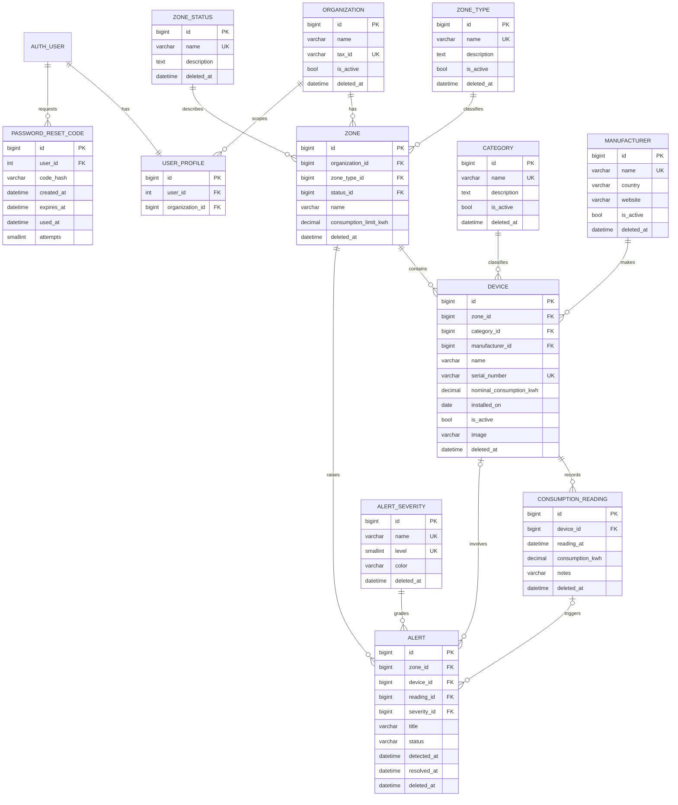

# EcoEnergy

Aplicación web Django para monitorear el consumo energético de las zonas y
dispositivos de varias organizaciones. Cada usuario trabaja solo con los datos
de su organización (scoping), según los permisos de su rol.

Proyecto de la **Evaluación Unidad II – Programación Back End (INACAP)**.

| Evidencia | Valor |
|---|---|
| Repositorio | https://github.com/JuanDuran-lab/ecoenergy-fase1 |
| Despliegue AWS Academy | http://13.218.34.129/ |
| Último commit integrado | Último merge en `main` (`git rev-parse --short HEAD`); el hash se informa en la entrega |
| Usuarios de prueba | `admin_demo`, `supervisor_norte`, `lector_sur` (contraseñas entregadas al docente, no publicadas) |

> La instancia EC2 corre en el AWS Academy Learner Lab: si el laboratorio se
> reinicia, la IP pública puede cambiar. En ese caso se actualiza esta tabla y
> las variables `DJANGO_ALLOWED_HOSTS` / `DJANGO_CSRF_TRUSTED_ORIGINS` del
> servidor (ver [`docs/DEPLOY_AWS.md`](docs/DEPLOY_AWS.md)).

---

## Tabla de contenidos

1. [Tecnologías](#tecnologías)
2. [Estructura del proyecto](#estructura-del-proyecto)
3. [Modelo de datos](#modelo-de-datos)
4. [Instalación local](#instalación-local)
5. [Variables de entorno](#variables-de-entorno)
6. [Migraciones y carga de datos](#migraciones-y-carga-de-datos)
7. [Usuarios, roles y permisos](#usuarios-roles-y-permisos)
8. [Funcionalidades y dónde está el código](#funcionalidades-y-dónde-está-el-código)
9. [Pruebas automatizadas](#pruebas-automatizadas)
10. [Despliegue en AWS Academy](#despliegue-en-aws-academy)
11. [Guion de demostración](#guion-de-demostración)
12. [Flujo de trabajo con Git](#flujo-de-trabajo-con-git)

---

## Tecnologías

| Componente | Uso |
|---|---|
| Python 3.12 + Django 6.1 | Framework back end |
| SQLite (por defecto) / PostgreSQL | Base de datos, elegida por variable de entorno |
| python-dotenv | Carga del archivo `.env` |
| Pillow | Validación del contenido real de las imágenes |
| openpyxl | Exportación a Excel (.xlsx) |
| Bootstrap 5 + Bootstrap Icons | Interfaz (CDN) |
| SweetAlert2 | Confirmación de eliminación (CDN) |
| Gunicorn + Nginx | Servidor de aplicación y servidor web en AWS |

## Estructura del proyecto

```
ecoenergy/            Configuración (settings por variables de entorno, urls, wsgi)
core/                 Código transversal, reutilizado por las demás apps
  models.py           SoftDeleteModel: created_at, updated_at, deleted_at + managers
  scoping.py          Filtro de QuerySets por organización del usuario
  mixins.py           ModelPermissionMixin y OrganizationScopedMixin
  views.py            Vistas base de CRUD (listar, ver, crear, editar, eliminar lógico)
  pagination.py       Paginación 5/15/30 guardada en request.session
  admin.py            Admin con borrado lógico, filtro de eliminados y restaurar
  static/core/js/confirm-delete.js   Confirmación con SweetAlert2
accounts/             Autenticación y seguridad
  models.py           UserProfile (organización) y PasswordResetCode (código 6 dígitos)
  validators.py       PasswordComplexityValidator
  forms.py / views.py Login, logout y recuperación de contraseña
monitoring/           Negocio: zonas, dispositivos, lecturas y alertas
  models.py           6 tablas maestras + 4 operacionales
  forms.py            ModelForm con validaciones de servidor
  views/              Una vista por entidad (zones, devices, readings, alerts, dashboard)
  filters.py          Filtros compartidos por listados y exportación
  queries.py          Métricas de consumo (excluye eliminados en los JOIN)
  exports.py          Construcción del .xlsx
  validators.py       Tamaño, extensión y contenido real de imágenes
  management/commands/seed_data.py   Carga de 1.521 registros
deploy/               Gunicorn (systemd), Nginx y script de actualización
docs/                 Diagrama ER y guía de despliegue
```

## Modelo de datos

Nombres técnicos de modelos, tablas (`db_table`) y campos en **inglés**
(snake_case para tablas y campos, PascalCase para modelos). Las etiquetas
visibles (`verbose_name`) están en español.

| Tipo | Modelo (tabla) | Descripción |
|---|---|---|
| Maestra | `Organization` (`organization`) | Empresa/sucursal; define el scoping |
| Maestra | `Category` (`category`) | Categoría de dispositivo |
| Maestra | `ZoneType` (`zone_type`) | Tipo de zona |
| Maestra | `ZoneStatus` (`zone_status`) | Estado operativo de la zona |
| Maestra | `Manufacturer` (`manufacturer`) | Fabricante del dispositivo |
| Maestra | `AlertSeverity` (`alert_severity`) | Severidad de alerta (nivel 1–4 y color) |
| Operacional | `Zone` (`zone`) | Zona con límite de consumo |
| Operacional | `Device` (`device`) | Dispositivo con número de serie e imagen |
| Operacional | `ConsumptionReading` (`consumption_reading`) | Lectura de consumo en kWh |
| Operacional | `Alert` (`alert`) | Alerta de consumo por zona/dispositivo/lectura |
| Apoyo | `UserProfile` (`user_profile`) | Usuario ↔ organización (OneToOne con `User`) |
| Apoyo | `PasswordResetCode` (`password_reset_code`) | Código de recuperación hasheado |

Todas las entidades de negocio heredan de `core.models.SoftDeleteModel`:

- `objects` (manager por defecto) **oculta** los registros con `deleted_at`.
- `all_objects` incluye los eliminados (lo usa el Admin para el filtro "Eliminados").
- `delete()` de instancias y QuerySets se convierte en borrado lógico.
- Unicidades (`UniqueConstraint`) condicionadas a `deleted_at IS NULL`, para
  poder reutilizar un nombre después de eliminar un registro.
- Cascada lógica: eliminar una zona elimina sus dispositivos, lecturas y
  alertas; eliminar un dispositivo elimina sus lecturas y alertas.



## Instalación local

Requisitos: **Python 3.12 o superior** y Git.

**Windows (PowerShell)**

```powershell
git clone https://github.com/JuanDuran-lab/ecoenergy-fase1.git
cd ecoenergy-fase1
python -m venv .venv
.\.venv\Scripts\Activate.ps1
pip install -r requirements.txt
Copy-Item .env.example .env      # luego completar las contraseñas SEED_*
python manage.py migrate
python manage.py seed_data
python manage.py runserver
```

**Linux / macOS**

```bash
git clone https://github.com/JuanDuran-lab/ecoenergy-fase1.git
cd ecoenergy-fase1
python3 -m venv .venv
source .venv/bin/activate
pip install -r requirements.txt
cp .env.example .env             # luego completar las contraseñas SEED_*
python manage.py migrate
python manage.py seed_data
python manage.py runserver
```

Abrir <http://127.0.0.1:8000/>.

> Si vienes de la Fase 1, **elimina el `db.sqlite3` anterior** antes de
> migrar: los modelos se renombraron a inglés y las migraciones se generaron
> de nuevo.

## Variables de entorno

Se definen en `.env` (copiado desde `.env.example`). El archivo `.env` está en
`.gitignore` y **nunca** se sube al repositorio.

| Variable | Obligatoria | Descripción |
|---|---|---|
| `DJANGO_SECRET_KEY` | Sí en producción | Clave secreta de Django |
| `DJANGO_DEBUG` | No (False) | `True` solo en desarrollo |
| `DJANGO_ALLOWED_HOSTS` | Sí en producción | Hosts permitidos, separados por coma |
| `DJANGO_CSRF_TRUSTED_ORIGINS` | En AWS | Ej: `http://<IP_PUBLICA>` |
| `DJANGO_USE_HTTPS` | No (False) | Activa cookies seguras si hay HTTPS |
| `DJANGO_MEDIA_ROOT` | No | Carpeta de imágenes subidas (por defecto `media/`) |
| `DB_ENGINE` | No (`sqlite`) | `sqlite` o `postgresql` |
| `DB_NAME`, `DB_USER`, `DB_PASSWORD`, `DB_HOST`, `DB_PORT` | Solo PostgreSQL | Conexión a la base |
| `SEED_ADMIN_PASSWORD`, `SEED_SUPERVISOR_PASSWORD`, `SEED_READER_PASSWORD` | Sí para `seed_data` | Contraseñas de los usuarios de prueba |
| `SEED_ADMIN_EMAIL`, `SEED_SUPERVISOR_EMAIL`, `SEED_READER_EMAIL` | No | Correos de los usuarios de prueba |
| `EMAIL_HOST`, `EMAIL_PORT`, `EMAIL_HOST_USER`, `EMAIL_HOST_PASSWORD`, `EMAIL_USE_TLS` | No | SMTP. Sin `EMAIL_HOST`, el correo se imprime en la consola |
| `DEFAULT_FROM_EMAIL` | No | Remitente de los correos |

## Migraciones y carga de datos

```bash
python manage.py migrate            # crea las tablas y los permisos
python manage.py seed_data          # carga inicial (base vacía)
python manage.py seed_data --reset  # borra los datos de negocio y recarga
```

`seed_data` es reproducible (semilla aleatoria fija) y genera:

| Datos | Cantidad |
|---|---|
| Organizaciones | 3 |
| Otras tablas maestras | 26 |
| Zonas | 24 (8 por organización) |
| Dispositivos | 120 |
| Lecturas de consumo | 1.200 (400 por organización, últimos 45 días) |
| Alertas | 148 (derivadas de lecturas sobre el consumo nominal) |
| **Total registros de negocio** | **1.521** |

También crea los grupos y los 3 usuarios de prueba. Las contraseñas se leen
del `.env` y se validan con la política de contraseñas antes de crearlos.

## Usuarios, roles y permisos

| Usuario | Rol (grupo) | Organización | Permisos |
|---|---|---|---|
| `admin_demo` | Administrador (superusuario) | Todas | Todo, incluido el Django Admin de todas las tablas |
| `supervisor_norte` | Supervisor | EcoEnergy Norte | Ver, crear, editar y eliminar zonas, dispositivos, lecturas y alertas; exportar a Excel; Admin con scoping |
| `lector_sur` | Lector | EcoEnergy Sur | Solo ver las 4 entidades y exportar a Excel |

Las contraseñas **no se publican**: se entregan al docente para la demostración.

Seguridad aplicada en cada vista (`core/mixins.py`):

1. Sin sesión → redirige al login.
2. Con sesión pero sin el permiso (`view`, `add`, `change`, `delete` o
   `export_consumptionreading`) → **403**.
3. Con permiso → `get_queryset()` filtra por organización: un registro de otra
   organización responde **404**, tanto al ver como al editar, eliminar o exportar.
4. En los formularios, los `<select>` de zona y dispositivo solo muestran
   registros de la organización. Un id ajeno enviado a mano es rechazado.

## Funcionalidades y dónde está el código

| Requerimiento | Implementación |
|---|---|
| Configuración por variables de entorno | `ecoenergy/settings.py`, `.env.example` |
| 6 maestras + 4 operacionales en inglés | `monitoring/models.py` |
| Django Admin coherente | `monitoring/admin.py`, `accounts/admin.py`, `core/admin.py` (scoping, inline, acciones, filtro de eliminados, restaurar) |
| Borrado lógico | `core/models.py` (`SoftDeleteModel`), cascada en `Zone.soft_delete()` y `Device.soft_delete()` |
| 1.000+ registros reproducibles | `monitoring/management/commands/seed_data.py` |
| Login / logout | `accounts/views.py` (`LoginView`, `LogoutView` por POST) |
| Recuperación con código de 6 dígitos | `accounts/models.py` (`PasswordResetCode`), `accounts/forms.py`, `accounts/views.py` |
| Política de contraseñas | `AUTH_PASSWORD_VALIDATORS` en settings + `accounts/validators.py` |
| Permisos y scoping | `core/mixins.py`, `core/scoping.py` |
| 4 CRUD con ModelForm | `core/views.py` (bases), `monitoring/views/*.py`, `monitoring/forms.py` |
| Validaciones de servidor | `monitoring/forms.py` (duplicados, reglas) y `clean()` en `monitoring/models.py` |
| Imagen con validación real | `monitoring/validators.py`, campo `Device.image`, formulario multipart |
| Paginación 5/15/30 en sesión | `core/pagination.py`, `core/templates/core/partials/pagination.html` |
| SweetAlert2 + POST/CSRF + soft delete | `core/static/core/js/confirm-delete.js`, `core/views.py` (`ScopedSoftDeleteView`) |
| Exportación a Excel | `monitoring/exports.py`, `ReadingExportView` en `monitoring/views/readings.py` |

### Recuperación de contraseña

1. `/cuentas/recuperar/`: el usuario ingresa su correo. La respuesta es la
   misma exista o no el correo, para no revelar usuarios registrados.
2. Se genera un código de 6 dígitos con `secrets`, se guarda **hasheado**
   (`make_password`) y se envía por correo. Expira en 10 minutos; pedir un
   código nuevo invalida el anterior.
3. `/cuentas/recuperar/confirmar/`: código + nueva contraseña dos veces
   (`SetPasswordForm`, que aplica todos los validadores y guarda con hash).
4. Al cambiar la contraseña, el código se marca como usado (`used_at`) y ya no
   sirve. Tras 5 intentos fallidos el código se bloquea.

### Exportación a Excel (investigación)

Se usa **openpyxl**: se crea un `Workbook` en memoria, se escribe una fila de
encabezados y una fila por cada lectura del QuerySet, se aplican formatos
(fecha, números, filtros, panel fijo) y se guarda en un `BytesIO` que se
devuelve con `Content-Type` de Excel y `Content-Disposition: attachment`.
El QuerySet es el mismo del listado: sin eliminados, con scoping por
organización y con los filtros activos. Una segunda hoja registra quién
exportó, cuándo, el alcance y los filtros.

## Pruebas automatizadas

```bash
python manage.py test
```

83 pruebas cubren: validaciones de modelos y formularios, borrado lógico y
cascada, scoping en vistas y Admin, permisos (403/404), recuperación de
contraseña (un solo uso, expiración, intentos), política de contraseñas,
imágenes (contenido falso, extensión, tamaño), paginación en sesión, CSRF en
la eliminación, exportación a Excel y el comando `seed_data`.

## Despliegue en AWS Academy

Guía completa en [`docs/DEPLOY_AWS.md`](docs/DEPLOY_AWS.md): EC2 Ubuntu 24.04,
Gunicorn como servicio systemd y Nginx sirviendo `/static/` y `/media/`.
Para actualizar después de un merge a `main`:

```bash
bash deploy/update.sh
```

## Guion de demostración

1. **Datos**: `python manage.py seed_data --reset` muestra el total (1.521).
   En el Admin, cada tabla muestra su cantidad.
2. **Login** con `lector_sur`: solo ve datos de EcoEnergy Sur, no tiene
   botones de crear/editar/eliminar; `/zonas/nueva/` responde 403.
3. **Paginación**: en Lecturas elegir 5 → cambiar de página y de listado (se
   mantiene 5). Probar `?per_page=1000` → se normaliza a 15.
4. **Excel**: con filtros aplicados, "Exportar a Excel" descarga solo lo visible.
5. **Login** con `supervisor_norte`: crear un dispositivo con imagen; intentar
   subir un archivo de texto renombrado a `.png` (rechazado).
6. **Validaciones**: zona duplicada, lectura mayor a 3 veces el consumo
   nominal, alerta "Resuelta" sin fecha.
7. **Eliminar**: confirmación con SweetAlert2 → el registro desaparece del
   listado. Con `admin_demo`, en el Admin, filtro "Eliminados (lógico)" lo
   muestra con su `deleted_at` y se puede restaurar.
8. **Scoping**: con `supervisor_norte`, abrir la URL de una zona de otra
   organización → 404.
9. **Recuperación de contraseña**: "¿Olvidaste tu contraseña?" → código por
   correo → nueva contraseña → reutilizar el mismo código (rechazado).

## Flujo de trabajo con Git

Después del push inicial, cada funcionalidad se desarrolló en su propia rama
y se integró a `main` mediante Pull Request:

| Rama | Contenido |
|---|---|
| `feature/project-restructure` | Apps `core`/`accounts`/`monitoring`, nombres en inglés, borrado lógico |
| `feature/data-model` | 6 maestras + 4 operacionales, imagen, validaciones de modelo |
| `feature/seed-data` | 1.521 registros, roles y usuarios |
| `feature/authentication` | Login/logout, recuperación con código, política de contraseñas |
| `feature/permissions-scoping` | Mixins de permisos y scoping, dashboard |
| `feature/crud-views` | 4 CRUD con ModelForm, imagen |
| `feature/session-pagination` | Paginación 5/15/30 en sesión |
| `feature/soft-delete-sweetalert` | Eliminación segura con SweetAlert2 |
| `feature/excel-export` | Exportación a Excel |
| `fix/ui-polish` | Ajustes visuales |
| `feature/deploy-config` | Gunicorn, Nginx y guía AWS |
| `docs/readme` | Esta documentación |
